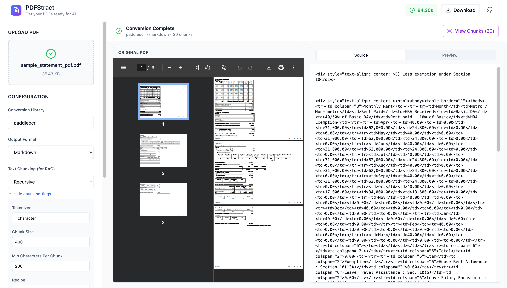
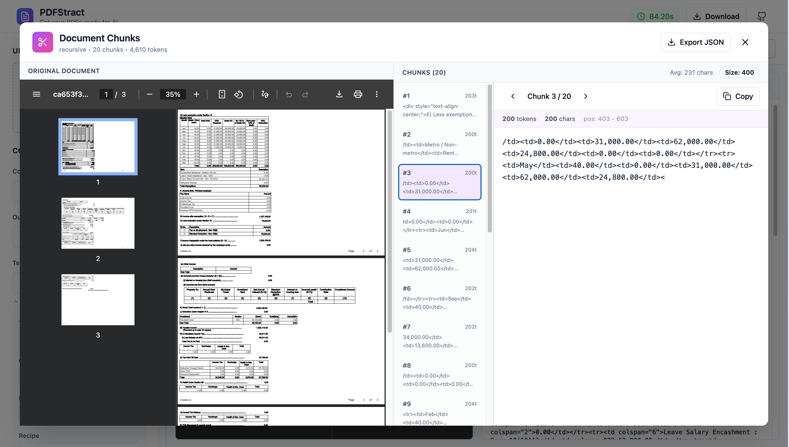

# PDFStract — The First Layer in Your RAG Pipeline 

Convert PDFs into chunks and embeddings ready for retrieval-augmented generation.

Available as CLI, Web UI and API — PDFstract is the first tool in your AI RAG pipeline. It's a simple tool to get your PDFs ready for AI, You can Extract Data, Chunk, Embed and use it in your RAG pipeline.

<p align="center">
  
  
  
  
</p>





### 🚀 What is PDFStract?

PDFStract is a tool to get your PDFs ready for AI - Extract Data, Chunk, Embed and use it in your RAG pipeline:

- ✅ Extract structured text, tables, and metadata from PDFs using various libraries (PyMuPDF4LLM, MarkItDown, Marker, Docling, PaddleOCR, DeepSeek-OCR, Tesseract, MinerU, Unstructured, and more)
- ✅ Chunk the text into smaller chunks using various libraries (Token, Sentence, Recursive, Table, Semantic, Code, Late, Neural, Slumber, and more)
- ✅ Embed the chunks using various libraries (Sentence Transformers, OpenAI, etc.)
- ✅ Use the chunks in your RAG pipeline 


## ✨ Features

- 🚀 **10+ Conversion Libraries**: PyMuPDF4LLM, MarkItDown, Marker, Docling, PaddleOCR, DeepSeek-OCR, Tesseract, MinerU, Unstructured, and more
- ✂️ **10+ Chunking Methods**: Token, Sentence, Recursive, Semantic, Code, Neural, Fast (SIMD), and more via Chonkie
- 📱 **Modern React UI**: Beautiful, responsive design with Tailwind CSS
- 💻 **Command-Line Interface**: Full CLI with batch processing, chunking, multi-library comparison, and automation
- 🎯 **Multiple Output Formats**: Markdown, JSON, and Plain Text
- ⏱️ **Performance Benchmarking**: Real-time timer shows conversion speed for each library
- 👁️ **Live Preview**: View converted content with syntax highlighting
- 🔄 **Library Status Dashboard**: See which libraries are available/unavailable with error messages
- ⬇️ **On-Demand Model Downloads**: Download ML models only when needed
- 💾 **Easy Download**: Download results in your preferred format
- 🐳 **Docker Support**: One-command deployment
- 🔗 **REST API**: Programmatic access to conversion and chunking features
- ⚡ **Batch Processing**: Parallel conversion of 100+ PDFs with detailed reporting
- 🌙 **Dark Mode Ready**: Works seamlessly in light and dark themes

## 📚 Supported Libraries

| Library | Version | Type | Status | Notes |
|---------|---------|------|--------|-------|
| **pymupdf4llm** | >=0.0.26 | Text Extraction | Fast | Best for simple PDFs |
| **markitdown** | >=0.1.2 | Markdown | Balanced | Microsoft's conversion tool |
| **marker** | >=1.8.1 | Advanced ML | High Quality | Excellent results, slower |
| **docling** | >=2.41.0 | Document Intelligence | Advanced | IBM's document platform |
| **paddleocr** | >=3.3.2 | OCR | Accurate | Great for scanned PDFs |
| **unstructured** | >=0.15.0 | Document Parsing | Smart | Intelligent element extraction |
| **deepseekocr** | Latest | GPU OCR | Fast (GPU only) | Requires CUDA GPU |
| **pytesseract** | >=0.3.10 | OCR | Classic | Tesseract-based (requires system binary) |

## 📦 Supported Chunkers

PDFStract includes 10+ chunking methods powered by [Chonkie](https://github.com/chonkie-inc/chonkie):

| Chunker | Description | Best For |
|---------|-------------|----------|
| **token** | Fixed token-based chunking | Simple, predictable chunks |
| **sentence** | Sentence boundary splitting | Natural text segments |
| **recursive** | Hierarchical delimiter-based | Structured documents |
| **table** | Table-aware chunking | Documents with tables |
| **semantic** | Embedding-based similarity | Topic-coherent chunks |
| **code** | AST-aware code splitting | Source code files |
| **fast** | SIMD-accelerated (100+ GB/s) | High-throughput pipelines |
| **late** | Late interaction chunking | ColBERT-style retrieval |
| **neural** | ML boundary detection | Complex documents |
| **slumber** | LLM-powered agentic chunking | Highest quality (requires API key) |

## 🚀 Quick Start

### Prerequisites

- **Python**: 3.11+
- **UV**: Fast Python package manager ([install](https://docs.astral.sh/uv/getting-started/installation/))
- **Node.js**: 20+ (for frontend development)
- **Docker** (optional): For containerized deployment

### Installation

1. **Clone the repository**:
```bash
git clone https://github.com/aksarav/pdfstract.git
cd pdfstract
```

2. **Install Python dependencies**:
```bash
uv sync
```

3. **Install frontend dependencies**:
```bash
cd frontend
npm install
cd ..
```

### Running Locally

**Terminal 1: Start the FastAPI Backend**
```bash
uv run uvicorn main:app --host 0.0.0.0 --port 8000 --reload
```

**Terminal 2: Start the React Frontend (Development)**
```bash
cd frontend
npm run dev
```

**Access the Application**:
- Frontend: http://localhost:5173 (with hot-reload)
- Backend API: http://localhost:8000

**Note**: The frontend development server proxies API calls to the backend at port 8000 (configured in `frontend/vite.config.js`)

### Production Build

To build the React app for production:
```bash
cd frontend
npm run build
```

This creates an optimized build in `frontend/dist/` which gets copied to `/static` by the Docker build process.

### Running with Docker

```bash
docker-compose up --build
```

The application will be available at `http://localhost:8000`

---

# 🖥️ Command-Line Interface (CLI)

PDFStract includes a powerful CLI for batch processing and automation.

### Quick CLI Examples

```bash
# List available libraries
pdfstract libs

# List available chunkers
pdfstract chunkers

# Convert a single PDF
pdfstract convert document.pdf --library pymupdf4llm --output result.md

# Convert and chunk in one command
pdfstract convert-chunk document.pdf --library pymupdf4llm --chunker semantic --output chunks.json

# Chunk an existing text file
pdfstract chunk document.md --chunker token --chunk-size 512 --output chunks.json

# Compare multiple libraries on one PDF
pdfstract compare sample.pdf -l pymupdf4llm -l marker -l docling --output ./comparison

# Batch convert 100+ PDFs in parallel
pdfstract batch ./documents --library pymupdf4llm --output ./converted --parallel 4

# Download models for a specific library
pdfstract download marker
```

### CLI Commands

| Command | Description |
|---------|-------------|
| `pdfstract libs` | List all available extraction libraries and their status |
| `pdfstract chunkers` | List all available chunkers and their parameters |
| `pdfstract convert` | Convert a single PDF file |
| `pdfstract chunk` | Chunk a text/markdown file |
| `pdfstract convert-chunk` | Convert PDF and chunk in one step |
| `pdfstract compare` | Compare multiple libraries on one PDF |
| `pdfstract batch` | Batch convert multiple PDFs in parallel |
| `pdfstract batch-compare` | Compare libraries across multiple PDFs |
| `pdfstract download` | Download models for a specific library |

### CLI Features

✨ **Full Features:**
- Single file conversion with any library
- **Text chunking** with 10+ chunking methods
- **Convert + Chunk** in a single command
- Multi-library comparison
- Parallel batch processing (1-16 workers)
- On-demand model downloads
- JSON reporting with detailed statistics
- Progress indicators and rich formatting

📊 **Batch Processing:**
- Convert 1000+ PDFs with parallel workers
- Detailed JSON reports (success rate, per-file status)
- Automatic error handling and logging
- Perfect for production jobs and legacy migrations

→ **[Full CLI Documentation](CLI_README.md)** - See complete guide with real-world examples

---

# API 

## API Endpoints

| Endpoint | Method | Description | Parameters |
|----------|--------|-------------|-----------|
| `/` | GET | Web interface | - |
| `/health` | GET | Health check | - |
| `/libraries` | GET | List available libraries with status | - |
| `/libraries/{name}/status` | GET | Get detailed status for a library | - |
| `/libraries/{name}/download` | POST | Download models for a library | - |
| `/convert` | POST | Convert PDF | `file`, `library`, `output_format` |
| `/chunkers` | GET | List available chunkers | - |
| `/chunk` | POST | Chunk raw text | `text`, `chunker`, `params` |
| `/convert-and-chunk` | POST | Convert PDF and chunk | `file`, `library`, `chunker`, `output_format`, `chunker_params` |
| `/compare` | POST | Compare multiple libraries | `file`, `libraries[]`, `output_format` |
| `/compare/{task_id}` | GET | Get comparison task status | - |

## API Examples

**List available libraries**:
```bash
curl http://localhost:8000/libraries
```

**List available chunkers**:
```bash
curl http://localhost:8000/chunkers
```

**Convert a PDF**:
```bash
curl -X POST \
  -F "file=@sample.pdf" \
  -F "library=pymupdf4llm" \
  -F "output_format=markdown" \
  http://localhost:8000/convert
```

**Convert and Chunk in one request**:
```bash
curl -X POST \
  -F "file=@sample.pdf" \
  -F "library=pymupdf4llm" \
  -F "chunker=semantic" \
  -F "output_format=markdown" \
  -F "chunker_params={\"chunk_size\": 512}" \
  http://localhost:8000/convert-and-chunk
```

**Chunk raw text**:
```bash
curl -X POST \
  -F "text=Your long document text here..." \
  -F "chunker=token" \
  -F "params={\"chunk_size\": 256}" \
  http://localhost:8000/chunk
```

**Download models for a library**:
```bash
curl -X POST http://localhost:8000/libraries/marker/download
```


## 🤝 Contributing

Contributions are welcome! Please:

1. Fork the repository
2. Create a feature branch
3. Make your changes
4. Submit a pull request


## 📞 Support

If you encounter issues or have questions - please create an issue

## 🌟 Please leave a star if you find this project useful

## 🙏 Acknowledgments

- **FastAPI**: Modern Python web framework
- **React**: UI library
- **Tailwind CSS**: Utility-first CSS framework
- **Lucide Icons**: Beautiful icon library
- **Chonkie**: Text chunking library for RAG pipelines
- All the amazing PDF extraction libraries (PyMuPDF, Marker, Docling, etc.)

---

**Made with ❤️ for AI RAG pipelines**
